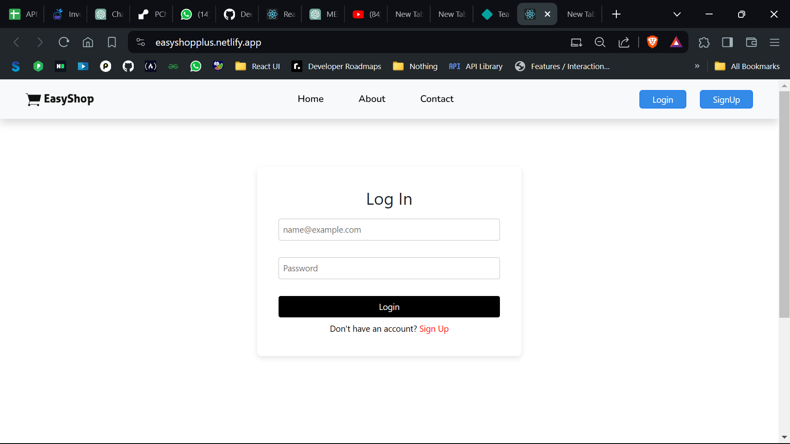
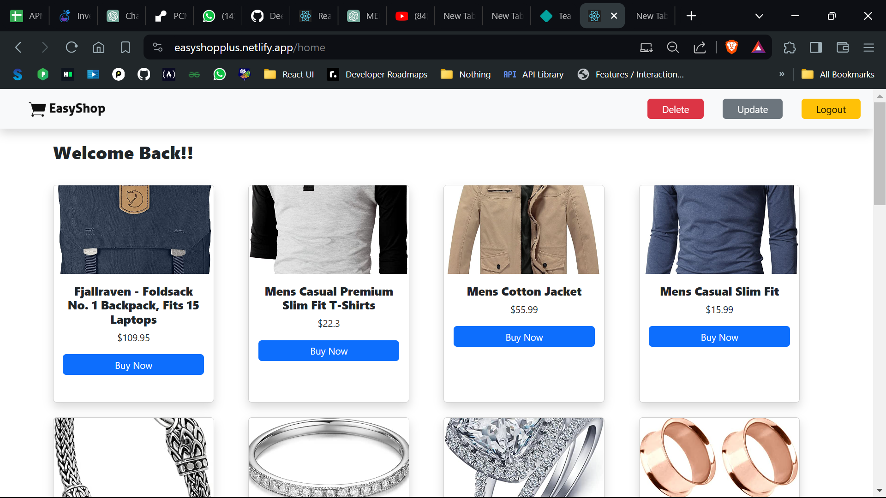

# E-Commerce Application

This project is a simple e-commerce application built using React for the frontend and a combination of React Router for routing and Bootstrap for styling. It allows users to register, log in, browse products, update their profile, and perform CRUD operations on products.

## Features

- **Authentication:** Users can register and log in to their accounts securely.
- **Product Catalog:** Browse through a list of available products.
- **Profile Management:** Users can update their profiles.

## Technologies Used

- Frontend: React, React Router, Bootstrap

## Installation

1. Clone the repository: `git clone <repository-url>`
2. Install dependencies: `npm install`
3. Start the development server: `npm start`

## Usage

1. Access the application in your web browser.
2. Register an account or log in if you already have one.
3. Browse through the products available.
4. Update your profile information if needed.
5. Admins can perform CRUD operations on products.

## File Structure

- **`src/`**: Contains the source code of the application.
  - **`Pages/`**: Contains the main pages of the application.
  - **`Components/`**: Contains reusable components used across the application.
  - **`Middleware/`**: Contains middleware components for authentication.
  - **`App.js`**: Entry point of the application.

### Login Page

### Dashboard

